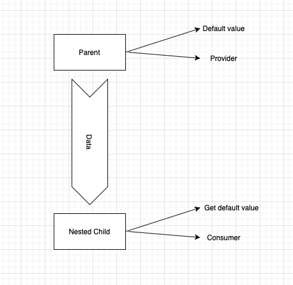
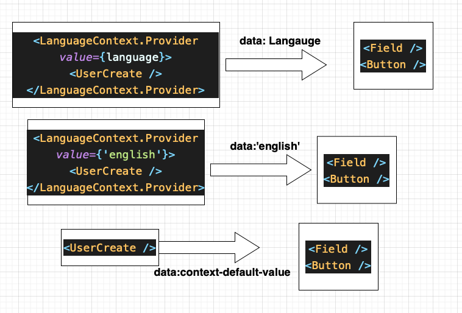

# React Context
Cheat-sheet for React Context 👍🏻<br />
<br />


## Basic idea
<hr>
It is used for communication between parent and nested children.(Root to leaf children that has no inner components.)
<br /><br />

## Relation of parent & children in Context <hr>


## Steps for working with Context
### Class Based:
1. Create a folder named `Context`  
2. Create your js file `ExampleContext.js`
3. Write the code below  

```javascript
import React from 'react'
export default React.createContext(<ContextContent>)
```

4. Wrap your parent root in `<NameofContext.Provider>`.
<br />The content of `value` is the value of context being set.
```javascript
import LanguageContext from '...'


<LanguageContext.Provider value={language}>
    <UserCreate />
</LanguageContext.Provider>
```

5. Use this context in children components:
<br /> `static` keyword is for letting a varibale to be initialized inside a component.

```javascript
class Field extends React.Component {
    static contextType = LanguageContext // contextType is reserved word

    render() {
        const text = this.context === 'english' ? 'Name' : 'Naam' // this.context is the context being fetched from parent 
        return (
            <div className="ui field">
             <label>{text}</label>
             <input />
         </div>
        )
    }
}
```
<hr>

**Note:** We can use context with no `Provider`. In that case, the components will use the default value of context.

```javascript
<LanguageContext.Provider value={language}> // passing Language as value
    <UserCreate />
</LanguageContext.Provider>

<UserCreate /> // passing default value of context (in this case: "english")
```
<hr>

**Note:** Each element that is using context inside of itself, is somehow generating a seperate pipe for transmitting data

```javascript
<LanguageContext.Provider value={language}>
    <UserCreate />
</LanguageContext.Provider>

<LanguageContext.Provider value={'english'}>
    <UserCreate />
</LanguageContext.Provider>

<UserCreate />
```

